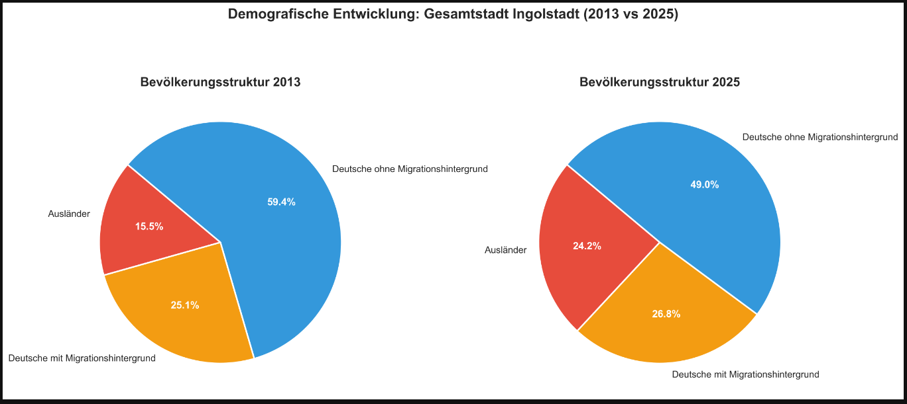
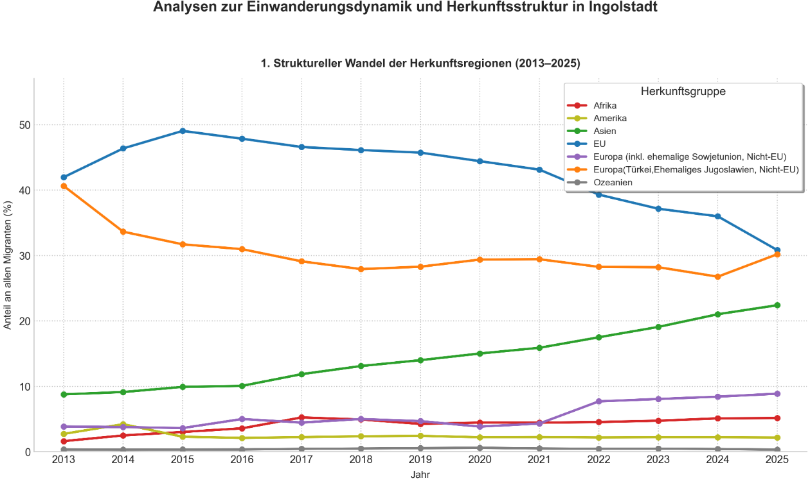
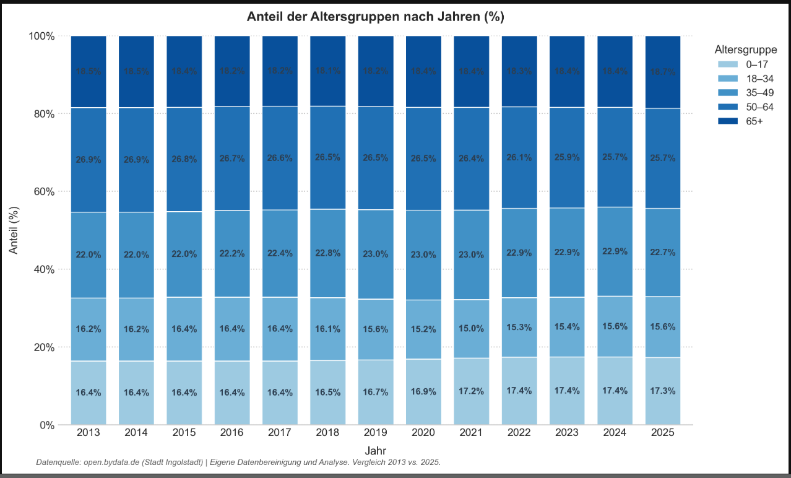
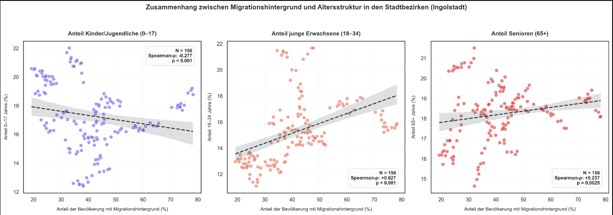
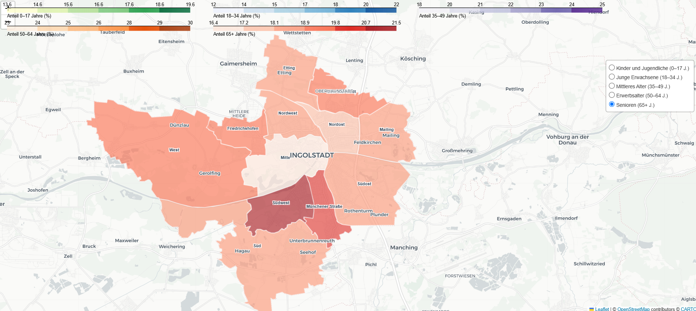
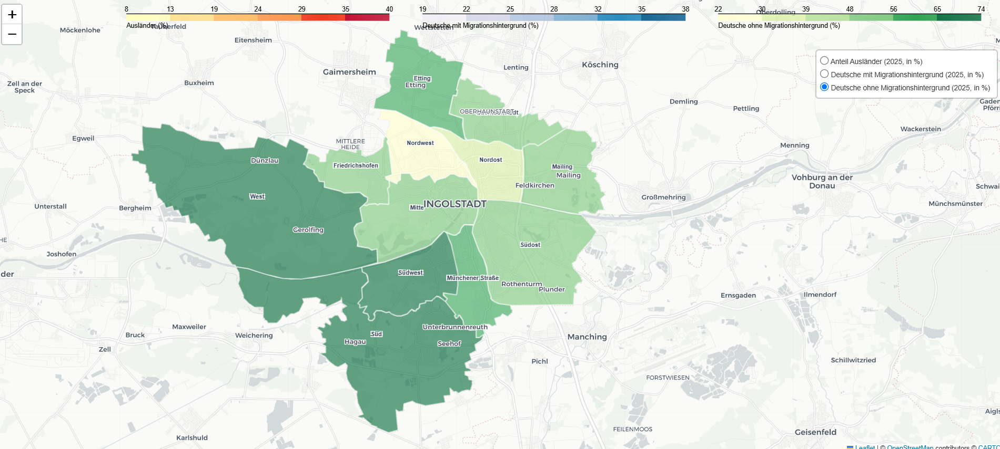

# Analyse der Herkunft und Altersverteilung von Migranten in Ingolstadt


## Projektübersicht

Dieses Projekt analysiert die Bevölkerungsstruktur der Stadt Ingolstadt anhand mehrerer Open-Data-Datensätze. Im Fokus stehen Migrationshintergrund, Herkunftsregionen, Altersstruktur sowie deren räumliche Verteilung auf Ebene der Stadtbezirke.

Der Schwerpunkt liegt auf der Datenintegration, Datenaufbereitung, explorativen Datenanalyse (EDA), statistischen Auswertung sowie der Visualisierung demografischer Kennzahlen.

Der gesamte Analyseprozess orientiert sich am **CRISP-DM-Modell** und wurde vollständig in **Python** umgesetzt.

### Projektvorschau



---

## Inhaltsverzeichnis

- [Projektziele](#projektziele)
- [Verwendete Datensätze](#verwendete-datensätze)
- [Verwendete Technologien](#verwendete-technologien)
- [Highlights](#highlights)
- [Projektablauf (CRISP-DM)](#projektablauf-crisp-dm)
- [Herausforderungen](#herausforderungen)
- [Zentrale Ergebnisse](#zentrale-ergebnisse)
- [Projektstruktur](#projektstruktur)
- [Projekt ausführen](#projekt-ausführen)
- [Beispielvisualisierungen](#beispielvisualisierungen)
- [Interaktive Karten](#interaktive-karten)
- [Demonstrierte Kompetenzen](#demonstrierte-kompetenzen)
- [Datenquelle](#datenquelle)
- [Projekterfolg](#projekterfolg)
- [Autor](#autor)

---

## Projektziele

Im Rahmen des Projekts wurden folgende Fragestellungen untersucht:

- Aus welchen Regionen stammen Migranten in Ingolstadt?
- Wie unterscheidet sich die Altersstruktur zwischen den einzelnen Stadtbezirken?
- Wie verteilen sich Personen mit und ohne Migrationshintergrund innerhalb der Stadt?
- Besteht ein Zusammenhang zwischen dem Anteil von Personen mit Migrationshintergrund und einer vergleichsweise jüngeren Altersstruktur?

---

## Verwendete Datensätze

Für die Analyse wurden fünf Open-Data-Datensätze der Stadt Ingolstadt kombiniert:

- Anteil der Ausländer nach Staatengruppen
- Einwohner nach Altersgruppen
- Ausländische Bevölkerung
- Deutsche mit Migrationshintergrund
- Deutsche ohne Migrationshintergrund

Durch die Integration mehrerer Datenquellen konnte ein umfassendes Bild der Bevölkerungsstruktur erstellt werden.

---

## Verwendete Technologien

- Python
- Jupyter Notebook
- Pandas
- NumPy
- SciPy
- GeoPandas
- Folium
- Matplotlib
- Seaborn
- OpenPyXL

---

## Highlights

- 📊 Integration von fünf Open-Data-Datensätzen
- 📁 Verarbeitung von CSV- und Excel-Daten
- 🧹 Datenbereinigung und Harmonisierung
- 🔄 Zusammenführung mehrerer Datenquellen
- 📈 Explorative Datenanalyse (EDA)
- 📉 Statistische Korrelationsanalyse
- 🗺️ Entwicklung von zwei interaktiven Karten mit Folium
- 📍 Geodatenanalyse mit GeoPandas
- 📚 Vollständige Umsetzung des CRISP-DM-Prozesses
- 🏆 Projektbewertung: **100 / 100 Punkte**

---

## Projektablauf (CRISP-DM)

### Business Understanding

- Definition der Projektziele
- Formulierung der Forschungsfragen

### Data Understanding

- Analyse der Datenstruktur
- Prüfung der Datentypen
- Identifikation fehlender Werte
- Prüfung auf Duplikate

### Data Preparation

- Datenbereinigung
- Vereinheitlichung der Bezirksnamen
- Transformation der Datumsangaben
- Umwandlung in ein einheitliches Long-Format
- Zusammenführung von fünf Datensätzen
- Validierung der Datenqualität

### Explorative Datenanalyse

- Analyse der Herkunftsregionen
- Analyse der Altersstruktur
- Analyse der räumlichen Verteilung
- Vergleich verschiedener Bevölkerungsgruppen

### Statistische Analyse

- Korrelationsanalyse zwischen Migrationsanteil und Altersstruktur
- Analyse der zeitlichen Entwicklung von 2013 bis 2025

### Visualisierung

- Balkendiagramme
- Zeitreihen
- Korrelationsdiagramme
- Interaktive Karten mit Folium

---

## Herausforderungen

Während der Datenaufbereitung mussten mehrere praktische Herausforderungen gelöst werden:

- Zusammenführung von fünf unterschiedlichen Datensätzen
- Harmonisierung verschiedener Datenstrukturen
- Vereinheitlichung von Bezirksbezeichnungen
- Bereinigung inkonsistenter Einträge
- Behandlung fehlender Werte
- Transformation der Daten in ein analysierbares Long-Format
- Validierung der Datenqualität

Diese Schritte ermöglichten eine konsistente und vergleichbare Datenbasis für die anschließende Analyse.

---

## Zentrale Ergebnisse

- Integration von fünf Open-Data-Datensätzen zu einem konsistenten Analysedatensatz
- Analyse von insgesamt **5.226 Beobachtungen**
- Identifikation regionaler Unterschiede in Herkunft und Altersstruktur
- Erstellung mehrerer statistischer Visualisierungen
- Entwicklung zweier interaktiver Karten zur räumlichen Analyse
- Nachweis eines stabilen statistischen Zusammenhangs zwischen Migrationsanteil und Altersstruktur (ohne kausale Interpretation)

---

## Projektstruktur

```text
population-analysis-ingolstadt
│
├── images
│   ├── demographic_development.png
│   ├── migration_regions.png
│   ├── age_distribution.png
│   ├── correlation_analysis.png
│   ├── foreign_population_map.png
│   └── population_without_migration_background_map.png
│
├── maps
│   ├── ingolstadt_demographics_2025.html
│   ├── ingolstadt_age_groups_2025.html
│   └── README.md
│
├── notebooks
│   └── population_analysis_ingolstadt.ipynb
│
├── .gitignore
├── LICENSE
├── README.md
└── requirements.txt
```

---

## Projekt ausführen

```bash
git clone https://github.com/tschviktoria-glitch/population-analysis-ingolstadt.git

cd population-analysis-ingolstadt

pip install -r requirements.txt

jupyter notebook
```

---

## Beispielvisualisierungen

### Herkunftsregionen



---

### Altersstruktur



---

### Demografische Entwicklung


---

### Zusammenhang zwischen Migrationshintergrund und Altersstruktur



---

### Räumliche Analyse

#### Ausländische Bevölkerung



#### Deutsche ohne Migrationshintergrund



---

## Interaktive Karten

Zusätzlich zu den statischen Visualisierungen wurden zwei interaktive Karten mit **Folium** erstellt.

### 🌍 Bevölkerungsstruktur nach Stadtbezirken

🔗 [Interaktive Karte öffnen](https://tschviktoria-glitch.github.io/population-analysis-ingolstadt/maps/ingolstadt_demographics_2025.html)

### 👥 Altersgruppen nach Stadtbezirken

🔗 [Interaktive Karte öffnen](https://tschviktoria-glitch.github.io/population-analysis-ingolstadt/maps/ingolstadt_age_groups_2025.html)

---

## Demonstrierte Kompetenzen

- Data Cleaning
- Data Preparation
- Data Wrangling
- Data Integration
- Explorative Datenanalyse (EDA)
- Statistische Analyse
- Korrelationsanalyse
- Datenvisualisierung
- Geodatenanalyse
- Data Storytelling
- Arbeiten nach dem CRISP-DM-Modell

---

## Datenquelle

Open Data Portal der Stadt Ingolstadt

https://ingolstadt.bydata.de/datasets

---

## Projekterfolg

Diese Projektarbeit wurde im Rahmen der Weiterbildung **Data Analytics** erstellt und mit der Bestnote bewertet.

🏆 **Bewertung: 100 von 100 Punkten**

Die Bewertung bestätigt die erfolgreiche Umsetzung des gesamten Analyseprozesses – von der Datenintegration und Datenaufbereitung bis zur statistischen Analyse, Visualisierung und Interpretation der Ergebnisse.

---

## Autor

**Viktoria Tschuchmann**

Junior Data Analyst

📧 tschviktoria@gmail.com

🔗 GitHub: https://github.com/tschviktoria-glitch

🔗 LinkedIn: *(Link zu deinem LinkedIn-Profil)*
